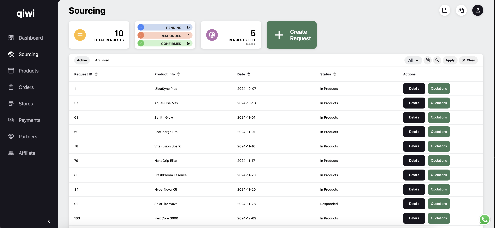

# Qiwi Project

**Qiwi** is a Shopify app designed to streamline the entire sourcing and order fulfillment process for merchants. It allows users to send sourcing requests to multiple suppliers, compare pricing, and choose the best option. Sourced products can be saved in the app and published to one or more connected stores. Qiwi automates the merchant order flow and also handles payments between merchants and suppliers.

The app integrates with Shopify APIs to manage stores, orders, and products, making it a complete solution for merchants. Suppliers also have a dedicated interface to respond to sourcing requests, fulfill orders, and provide performance metrics such as average processing times for quotes.

---

## 📊 Overview Dashboard  
The **overview dashboard** provides merchants with key statistics about their orders, including pending sourcing requests and fulfillment performance.

---

## 🛒 Sourcing Requests  
The **Sourcing Page** allows merchants to view and manage their sourcing requests. Merchants can track the status of each request, compare quotes from suppliers, and make informed decisions based on supplier performance.

---

## ➕ Create a Sourcing Request  
The **Sourcing Request Form** lets merchants create detailed requests tailored to their needs. They can specify product requirements, add support for variants, and select target countries for shipping.

---

## 🏢 Supplier Interface  
On the **Supplier Page**, suppliers can respond to sourcing requests with quotes and updates. This interface helps suppliers manage their interactions with merchants and handle fulfillment tasks seamlessly.

---

## 📦 Product Library  
The **Product Library** gives merchants an organized view of their saved products. From here, they can easily publish products to one or multiple connected Shopify stores.

---

## 📈 Orders Management  
The **Orders Management Page** enables merchants to handle incoming and completed orders. Features include payment processing, merging orders for combined shipping, and tracking fulfillment progress.

---

## 🛠️ Key Features

- **Streamlined Sourcing**: Send sourcing requests to multiple suppliers, compare quotes, and select the best options.
- **Integrated Product Management**: Save products, manage variants, and easily sync them with connected Shopify stores.
- **Efficient Fulfillment**: Handle orders and payments directly in the app.
- **Supplier Interface**: A dedicated platform for suppliers to respond to sourcing requests and fulfill orders.
- **Shopify Integration**: Full integration with Shopify APIs to manage stores, orders, and products.

---

## 🚀 Technologies Used

- **Frontend**: React, SASS  
- **Backend**: Node.js, MariaDB  
- **Third-Party Integrations**: Shopify APIs, payment gateways  

---

[🔙 Back to Portfolio](../README.md)
