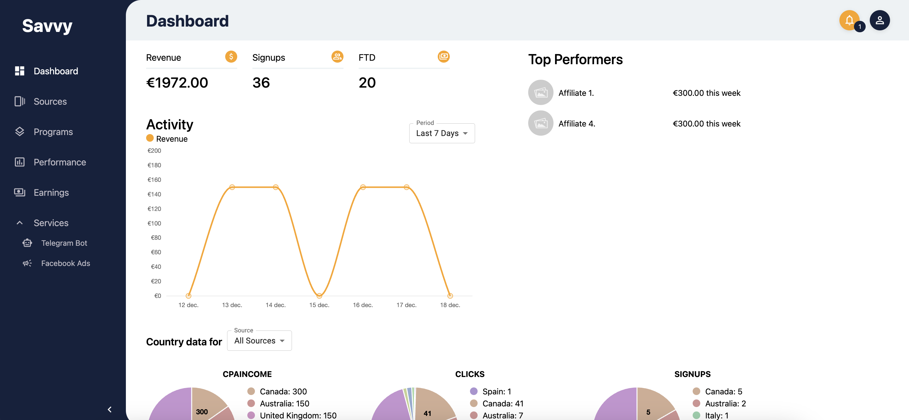

# Savvy Project

**Savvy** is a casino affiliate system that allows users to connect to various affiliate programs and track their performance in real-time. A significant part of the project involved collecting data from multiple APIs provided by the affiliate programs and consolidating it into a unified dashboard.

---

## 📊 Overview Dashboard  
The **overview dashboard** provides users with a quick summary of their performance, including real-time metrics and aggregated data from all connected affiliate programs.

---

## 🔗 Connect and Track Programs  
Users can **connect to affiliate programs** of their choice and manage the programs they are participating in. This section provides details about active connections and streamlines the integration process with new platforms.

---

## 📈 Performance Tracking  
The **performance tracking page** allows users to monitor their earnings and statistics over time. Advanced features include sorting, filters, and detailed breakdowns to help users analyze their performance across programs.

---

## 🛠️ Key Features

- Unified dashboard for tracking affiliate performance across multiple sources.
- Easy integration with multiple affiliate program APIs.
- Real-time performance insights with advanced filtering and sorting options.
- Simplified program connection process.

---

## 🚀 Technologies Used

- **Frontend**: React, SASS  
- **Backend**: Node.js, MariaDB, PHP  
- **Third-Party Integrations**: Affiliate program APIs and postbacks, Telegrambot APIs and webbhooks.

---

[🔙 Back to Portfolio](../README.md)
